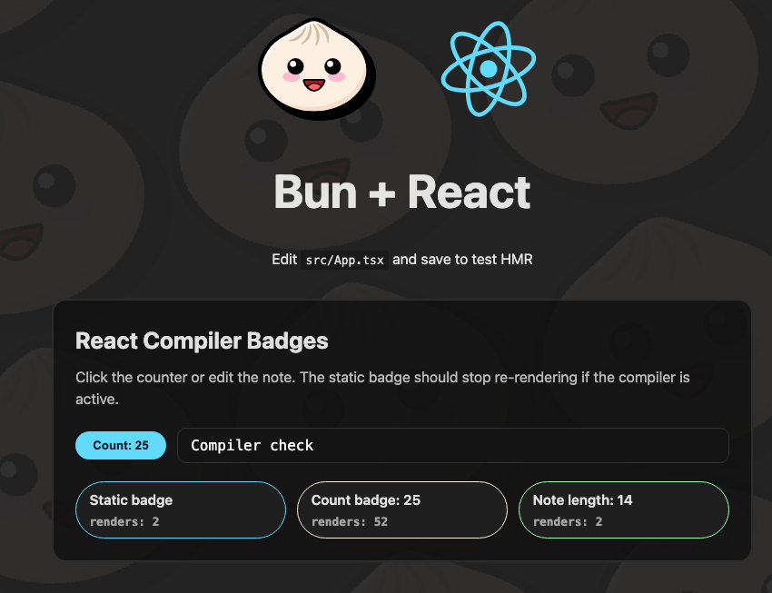

# React Compiler playground (Bun + Vite)



This repo is a small playground for trying the React Compiler in two build
setups: Bun and Vite. It exists to compare how the compiler fits into each
toolchain and to keep a minimal, side-by-side example you can tweak.

## What is inside

- `bun-example`: React app configured to run with Bun.
- `vite-example`: React app configured to run with Vite.

Each example is standalone and focuses on enabling the React Compiler with as
little extra setup as possible.

## Quick start

Bun:

```bash
cd bun-example
bun install
bun dev
```

Vite:

```bash
cd vite-example
npm install
npm run dev
```

## Notes about Bun

* A custom `./build.ts` script is used because the `bun build` CLI doesn't currently support plugins (see https://github.com/oven-sh/bun/issues/20619).
* A custom `./bun-plugin-react-compiler.ts` is used instead of `https://www.npmjs.com/package/bun-plugin-react-compiler` because the latter can't be used in `bunfig.toml` to enable react compiler in `development` mode.
